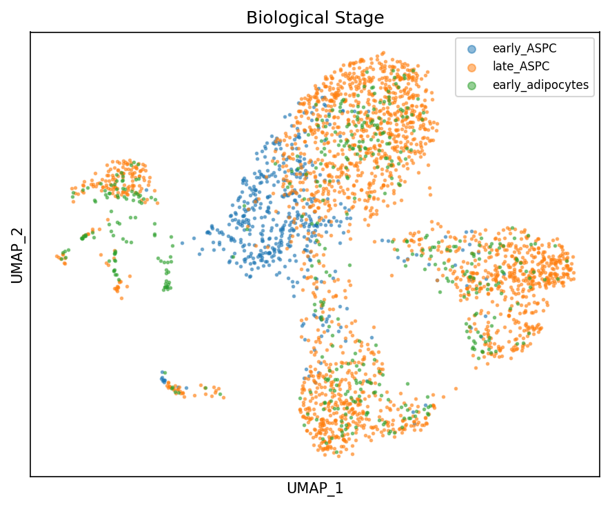
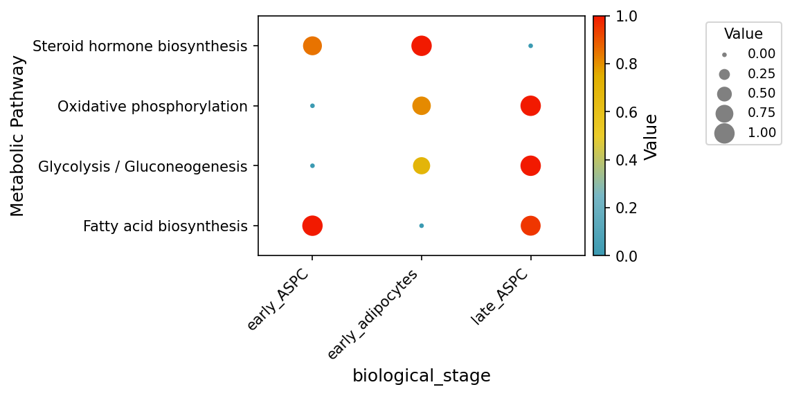
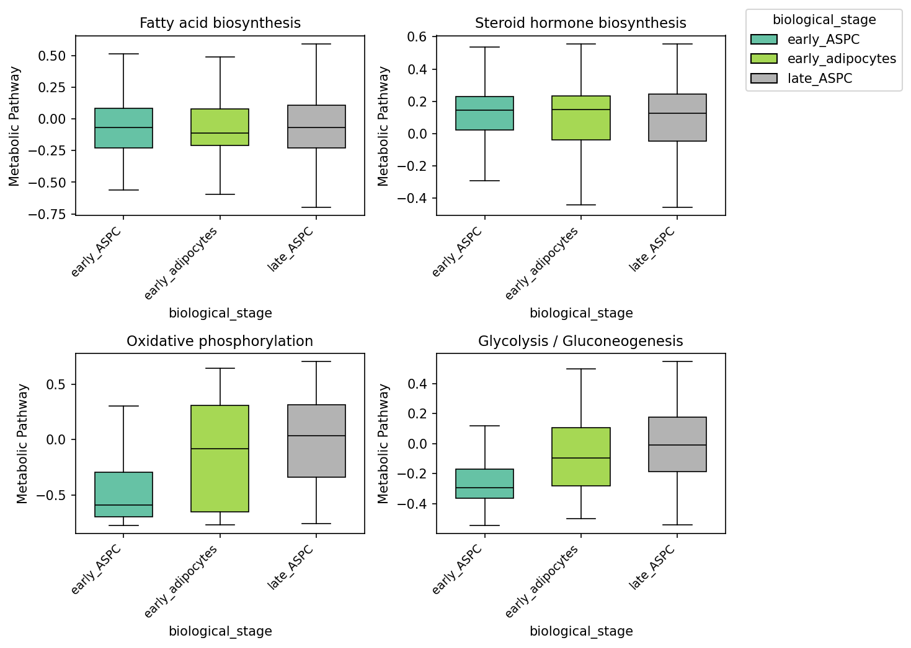

<p align="center">
  
</p>

<div align="center">


| | |
|---:|:---|
| **CI/CD** | [](https://github.com/omicverse/py-scmetabolism/actions)  |
| **Package** | [](https://pypi.org/project/py-scmetabolism/) [](https://pepy.tech/project/py-scmetabolism) |
| **Meta** | [](https://scverse.org/packages/#ecosystem) [](LICENSE) [](https://github.com/omicverse/py-scmetabolism) |

</div>

---

A **pure-Python re-implementation of scMetabolism** (Wu et al., *Cancer Discovery* 2021) for quantifying metabolic pathway activity at single-cell resolution.

- AnnData-native — drop-in for the scanpy ecosystem
- No `rpy2`, no R install required
- **3–45× faster than R scMetabolism** through optimized algorithms
- Correlation with R scMetabolism ≥ 0.99 for most methods (see below)

## Install

```bash
pip install py-scmetabolism
```

## Quick-start

```python
import scanpy as sc
import py_scmetabolism as scm

adata = sc.read_h5ad("mydata.h5ad")

scm.sc_metabolism_anndata(adata, method="AUCell", metabolism_type="KEGG")

scm.dimplot_metabolism(adata, pathway="Glycolysis / Gluconeogenesis", reduction="umap")
```

Results are stored in `adata`:

| Slot | Contents |
|---|---|
| `adata.obsm['X_metabolism']` | pathway × cell score matrix |
| `adata.uns['metabolism_pathways']` | list of pathway names |
| `adata.uns['metabolism_method']` | scoring method used |

---

## Mathematical implementation

Every algorithm below yields **mathematically equivalent** results to the R reference.

### VISION — library-size normalization + z-score

R VISION applies log2 transformation after library-size normalization:

```
scaled = expression × (median_col_sum / col_sum)
logged = log2(scaled + 1)
z_normed = (logged - col_mean) / col_std  # ddof=1
score = mean(z_normed[pathway_genes, ])
```

### AUCell — ordinal ranking recovery curve

1. Rank genes by descending expression (ties preserved)
2. Take top `aucMaxRank = ceil(0.05 × n_genes)` genes
3. Compute AUC of recovery curve (rank vs binary hit/miss)

### ssGSEA — rank-based position weighting

1. Column ranks with `ties.method="average"`, truncated to integer
2. Weight by `|R|^α` (α = 0.25)
3. Position weight from descending sort: `pos_weight = n - position + 1`
4. Closed-form walk: `sum(Ra × pos_weight) / sum(Ra) - sum_out_pos / (n - k)`

### GSVA — kernel density estimation

1. For each gene, compute `left_tail = mean(ppois(expr[i,j], expr[i,k] + 0.5))`
2. Apply logit: `result = -log((1 - left_tail) / left_tail)`
3. Column ranks with `ties.method="last"`
4. Kuiper walk: `srs = |p/2 - rank|`, `dos = p - rank + 1`

---

## Benchmarks

All timings on a single Intel Xeon node; correlations computed pathway-by-pathway against R scMetabolism on the same input data (3000 cells × 19281 genes, KEGG pathways).

| Method | Python | R | Speedup | Correlation (vs R) |
|---|---|---:|---:|---:|
| VISION | 1.8 s | 83.4 s | **45.7×** | 0.9988 |
| AUCell | 3.7 s | 13.0 s | 3.5× | 0.9327 |
| ssGSEA | 7.2 s | 21.5 s | 3.0× | **1.0000** |
| GSVA | 20.4 s | 886.2 s | **43.5×** | 0.9870 |

**Same algorithm. Same inputs. Significantly faster, numerically faithful.**

---

## Notebooks

All notebooks are executed and ship with outputs committed.

| Notebook | What it covers |
|---|---|
| [`examples/tutorial.ipynb`](examples/tutorial.ipynb) | Complete metabolic pathway analysis pipeline on human adipocyte scRNA-seq |

The tutorial covers:
1. Loading real single-cell data (3000 cells × 19281 genes)
2. Computing pathway activity with VISION, AUCell, ssGSEA, GSVA
3. Visualizing results (UMAP, dot plot, box plot)
4. Validating Python vs R correlation
5. Speed comparison





## Supported methods

| Method | Description |
|--------|-------------|
| VISION | Library-size-normalized mean expression with z-score normalization |
| AUCell | Ordinal ranking-based recovery curve AUC within aucMaxRank cutoff |
| ssGSEA | Rank-based enrichment with position-weighted walking |
| GSVA | Kernel density estimation with Kuiper statistic |

## Data

Built-in pathway gene sets:

- KEGG metabolism (85 pathways, 1667 unique genes)
- REACTOME metabolism (82 pathways)

## Citation

If you use this package, please cite the original scMetabolism paper:

> Wu, Y. *et al.* **Spatiotemporal Immune Landscape of Colorectal Cancer Liver Metastasis at Single-Cell Level.** *Cancer Discovery* (2021).

## License

GNU GPL-3.0
